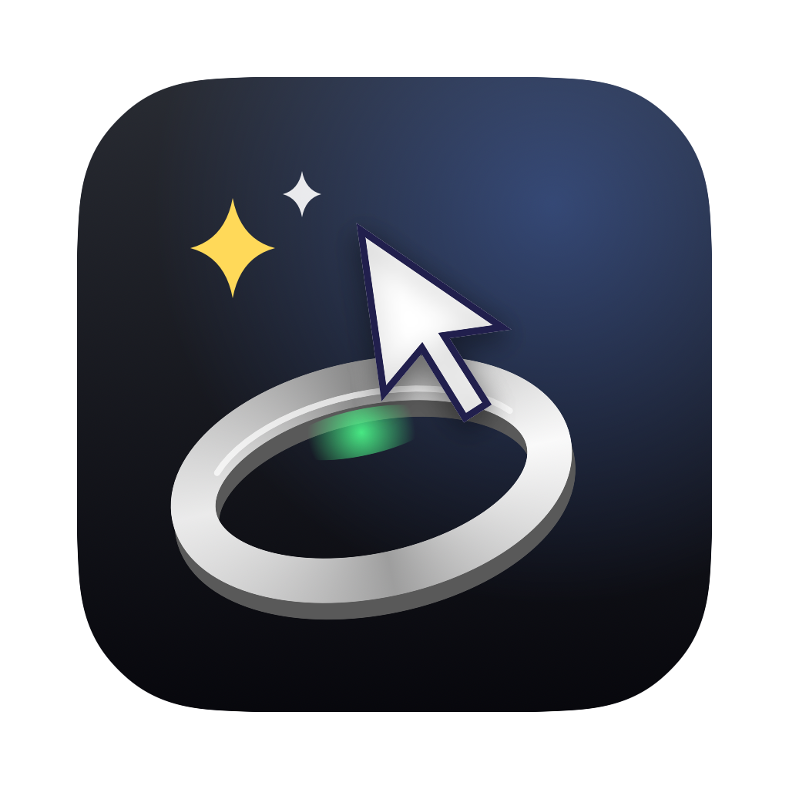
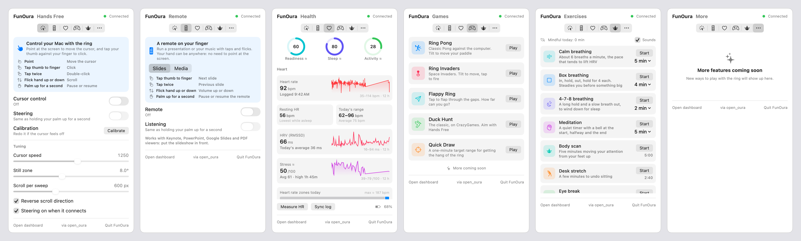

<p align="center">
  
</p>

<h1 align="center">FunOura</h1>

<p align="center">
  <b>Turn a spare Oura ring into a magic wand for your Mac.</b><br>
  Point at the screen to move the cursor. Tap your thumb to click. Flick to scroll.<br>
  Run your slides from your pocket, watch your health, breathe, play.
</p>

<p align="center">
  
  
  
  
</p>

<p align="center">
  <a href="docs/screenshots/tabs-dark.png">
    <picture>
      <source media="(prefers-color-scheme: dark)" srcset="docs/screenshots/tabs-dark.png">
      
    </picture>
  </a>
</p>

<p align="center">
  <sub>The whole app, left to right: <b>Hands Free</b> · <b>Remote</b> · <b>Health</b> · <b>Games</b> · <b>Exercises</b> · <b>More</b>. It lives in your menu bar.</sub>
</p>

---

> ### 🙏 Built on open_oura
> FunOura exists because **[Thomas Marchand (@Th0rgal)](https://github.com/Th0rgal)** reverse-engineered the Oura ring's Bluetooth protocol and open-sourced it as **[open_oura](https://github.com/Th0rgal/open_oura)** (MIT License): pairing, auth, live heart rate, the accelerometer stream and the ring's full event history, with no Oura account and no cloud. Every byte FunOura gets from the ring comes through open_oura. Thank you for opening it up. ⭐ Go star it.
>
> His iOS app and web dashboard built on the same crates live in [open_health](https://github.com/Th0rgal/open_health).

---

## What it does

FunOura lives in your menu bar. Click the ring icon for six tabs.

### 🖱️ Hands Free: control your Mac with the ring
The headline act. Make a finger gun with the ringed hand and **point at the screen**: the cursor follows. No camera, no extra hardware, just the ring's accelerometer.

| Gesture | Does |
| --- | --- |
| Point | Move the cursor |
| Tap your thumb against your finger | Click |
| Tap twice | Double-click |
| Flick your hand up or down | Scroll (flick again to scroll further) |
| Palm up for a second | Pause or resume |

A built-in **Calibrate** button walks you through five poses so the cursor fits your hand. Speed, dead zone and scroll distance are sliders.

### 🎛️ Remote: a clicker on your finger
Your hand can be anywhere (in your pocket, behind your back) because you don't need to point.

| Gesture | Slides | Media |
| --- | --- | --- |
| Tap | Next slide | Play / pause |
| Tap twice | Previous slide | Next track |
| Flick up / down | Volume | Volume |
| Palm up for a second | Pause the remote | Pause the remote |

Works with Keynote, PowerPoint, Google Slides, PDF viewers, Music, Spotify and video in the browser.

### ❤️ Health: your ring's data, on your Mac, offline
Readiness, sleep and activity scores; heart rate, resting heart rate, HRV, stress and heart-rate zones; steps, calories, active and sitting time; last night's sleep with stages; skin temperature and its change, blood oxygen, breathing rate, VO₂ max and cardio fitness. Plus a 30-second live heart-rate reading. Everything is worked out on your Mac from what the ring logs, and values marked **≈** are estimates.

### 🎮 Games
**Ring Pong**: Pong against the computer; tilt to move your paddle. **Ring Invaders**: Space Invaders; tilt to move, tap to fire. **Flappy Ring**: tap to flap through the gaps. **Duck Hunt**: the classic, played with your finger gun. **Quick Draw**: a one-minute shooting gallery made for aiming with Hands Free.

### 🧘 Exercises
Calm (resonance), box and 4-7-8 breathing with a circle to breathe along with, a meditation timer with bells, a body scan, a desk stretch and a 20-20-20 eye break. It counts your mindful minutes, and afterwards one click measures how your heart settled.

---

## ⚠️ Read this first

- **Use a spare or retired ring.** To talk to FunOura, the ring gets factory-reset and paired with a new key. After that the **Oura app and your Oura account no longer work with that ring** (until you reset it again and set it up in the Oura app). Don't pair the ring you rely on.
- Tested with an **Oura Ring 4**. open_oura is designed for Ring 3, 4 and 5.
- FunOura is a fun side project. It is **not affiliated with Oura**, and it is **not a medical device**: the Health numbers are estimates, not medical advice.

---

## Quick start

You need a Mac on **macOS 14 (Sonoma) or newer**, Apple silicon or Intel.

**1. Install the tools** (skip what you have)

```bash
xcode-select --install                                           # Swift, git, Python 3
curl --proto '=https' --tlsv1.2 -sSf https://sh.rustup.rs | sh   # Rust, to build open_oura
```

**2. Get FunOura and build it**

```bash
git clone https://github.com/<you>/FunOura.git
cd FunOura
./setup.sh
```

`setup.sh` checks your tools, downloads open_oura, applies FunOura's small patch, builds it, and builds `FunOura.app`. It takes a couple of minutes the first time.

**3. Pair your ring**

Factory-reset the spare ring first. With the Gen3 / Ring 4 charging dock:

1. Take the ring off the dock, put it back, and wait about 2 seconds.
2. Flip the dock, ring and all, **upside down**: wait for **blue**.
3. **Upright**: wait for **red**.
4. **Upside down**: wait for **magenta**.
5. **Upright**: wait for **yellow**. The reset has started, and a few minutes later the light blinks blue.

(More in open_oura's [factory-reset guide](https://github.com/Th0rgal/open_oura/blob/main/docs/factory-reset.md).) Then:

```bash
./pair.sh
```

It finds the ring (a reset ring shows up as "Oura" plus its serial number), pairs it, switches on heart rate and blood oxygen, and saves the ring in `ring.json`.

**4. Open it**

```bash
open funoura/FunOura.app
```

Click the ring icon in the menu bar. Allow **Bluetooth** when macOS asks, and turn on **FunOura** under System Settings › Privacy & Security › **Accessibility** (it asks on first launch). Then go to **Hands Free** and click **Calibrate**.

> 💡 FunOura ships with a starter calibration and tap profile so Hands Free and Remote work straight away, but they were made on someone else's hand. **Calibrate once** and it'll feel much better.

To start FunOura when you log in, add `FunOura.app` in System Settings › General › Login Items. You can move the app to `/Applications`; it remembers where this folder is.

---

## Tips

- **Clicks**: tap firmly while your hand is still. Taps during movement are ignored on purpose, so typing doesn't click.
- **Cursor won't start**: with steering on, aim at the middle of the screen once. If you hear a low "bonk" instead, the ring has turned on your finger since you calibrated: turn it back, or calibrate again.
- **Scroll the wrong way?** Tick *Reverse scroll direction* in Hands Free.
- The ring does one thing at a time. Hands Free and Remote swap for each other when you switch one on; a heart-rate reading or a sync has to wait until they're off.
- **Health** fills in as you wear the ring. Click **Sync log** to pull what it logged; wear it to bed for sleep.

---

## How it works

```
 Oura ring ──Bluetooth──▶ open_oura (Rust CLI) ──▶ dashboard/server.py ◀──localhost──▶ FunOura.app
                              │                          │
                              │ accel --jsonl            ├─ ringmouse/ringmouse.py  gestures → cursor / keys
                              └─ sync, live-hr, info     └─ dashboard/health.py     ring log → Health metrics
```

- **`funoura/`**: the SwiftUI menu bar app. It starts the server when it opens and stops it when you quit.
- **`dashboard/`**: a small Python server (standard library only) that owns the ring, runs one job at a time, and streams live updates to the app. It also serves a web dashboard at http://127.0.0.1:8787.
- **`ringmouse/`**: turns the ring's ~50 Hz accelerometer stream into a pointer. A finger-gun pose maps tilt to cursor speed (joystick style), a sharp jolt with a still hand is a tap, a push-and-brake is a flick, and palm up is the on/off switch.
- **`patches/`**: the small patch FunOura adds to open_oura (see [patches/README.md](patches/README.md)).

Nothing leaves your Mac. The ring's log is stored in `dashboard/oura.db`.

---

## Troubleshooting

**"Turn on FunOura in Accessibility", but it's already on.** Each build gets a new ad-hoc signature, and macOS still has the old one on record. In System Settings › Privacy & Security › Accessibility, select FunOura, remove it with **−**, then add `funoura/FunOura.app` again with **+**.

**Bluetooth.** FunOura asks for Bluetooth itself. `pair.sh` runs in your terminal, so macOS asks on behalf of your terminal app. If it stops with *"Abort trap: 6"* or says the terminal isn't allowed Bluetooth, look for your terminal app under System Settings › Privacy & Security › Bluetooth and turn it on. If it isn't listed, try Apple's Terminal or iTerm2.

**"Couldn't reach the ring."** Keep it close and charged. Putting it on the charger for a moment wakes it up.

**"No ring is paired yet."** Run `./pair.sh`.

**Rebuild after pulling changes:** `./setup.sh` (or just `funoura/build.sh` for the app), then quit and reopen FunOura.

---

## Hacking on it

- `funoura/build.sh --open` rebuilds and relaunches the app. The app is plain Swift files, no Xcode project.
- Run the ring mouse without the app: `ringmouse/run.sh` (add `--recalibrate` or `--remote slides`; `python3 ringmouse/ringmouse.py --help` for all the flags).
- Try things without a ring: point `OURA_BIN` at a stand-in program that prints `{"x":…,"y":…,"z":…}` lines for `accel`, and set `SCREENOURA_DRY_RUN=1` so nothing moves the real cursor or presses keys:
  ```bash
  OURA_BIN=/path/to/stub SCREENOURA_DRY_RUN=1 PORT=8788 python3 dashboard/server.py
  open funoura/FunOura.app --args -serverURL http://127.0.0.1:8788
  ```
- The logo is drawn in code: `funoura/Assets/logo.swift`.

Ideas welcome. Next up: drawing shapes in the air to trigger actions, and a live biofeedback mode for the breathing exercises.

---

## Credits and license

- **[open_oura](https://github.com/Th0rgal/open_oura)** by **Thomas Marchand**, MIT License: the Oura ring protocol and client that make all of this possible. FunOura downloads it at setup and applies [a small patch](patches/README.md); its license stays with its code.
- FunOura is released under the [MIT License](LICENSE).
- Oura and Oura Ring are trademarks of Oura Health Oy. FunOura is an independent project, not affiliated with or endorsed by Oura.
